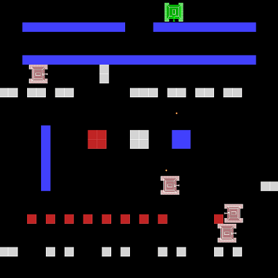
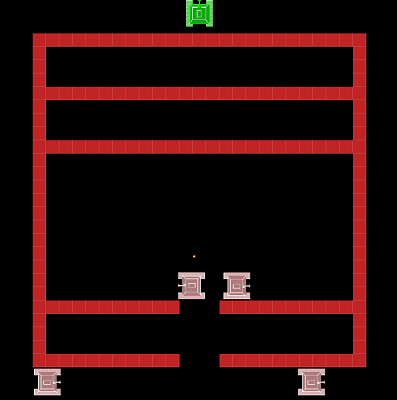
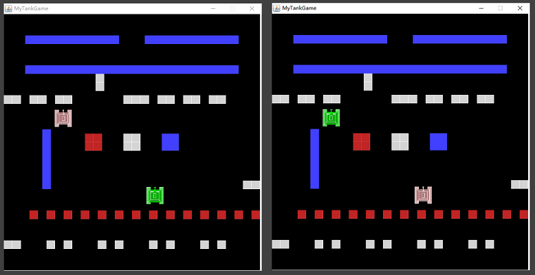

# 基于Netty的联机版坦克大战

## 项目介绍
该项目实现了联机版坦克大战，项目包括客户端与服务端

项目使用技术：
- 使用Netty实现客户端和服务端之间的通讯
- 使用Marshalling作为编解码技术
- 游戏界面使用java自带的swing与awt进行编写
- 使用Spring的依赖注入与java的反射机制简化了消息类型的判定
- 使用Mysql数据库
- 使用log4j记录日志

实现功能：
- 人机对战
- 多玩家开房间对战
- 碰撞检测
- 机器坦克使用A*算法，进行路径规划
- 机器坦克有巡逻范围的概念，当玩家坦克进入其巡逻范围，机器坦克才会使用A*寻路前往玩家坦克的位置
- 限制了子弹的飞行距离，当子弹到达飞行距离上限、击中障碍物、碰到边界时，子弹会爆炸。子弹爆炸是范围性伤害，在爆炸范围内，砖块和坦克都会被消灭
- 游戏支持多地图，玩家可以选择任意一幅地图
- 实现心跳机制，断线重连功能
- 在人机对战模式中，支持进度保存
- 实现用户登录、注册等功能

## 效果展示

在人机对战模式中，有多幅地图可供选择：

 &nbsp;&nbsp;&nbsp;&nbsp;

 &nbsp;&nbsp;&nbsp;&nbsp;

玩家对战模式：
 
 

## 使用方式
本项目使用maven构建，原则上不需要用户自行下载各种jar包，但是在pom.xml中添加jboss-marshalling-serial-1.3.0.CR9.jar
依赖包，运行程序时会抛出异常，无法正常运行(原因暂时不明)，因此需要还自行将lib文件夹下的jboss-marshalling-serial-1.3.0.CR9.jar包添加到客户端和服务端的Build
Path中

使用步骤：
- 将lib文件夹下的jar包添加到Build Path
- 安装Mysql数据库，将根目录下的tank_db.sql文件导入数据库
- 设置数据库账号和密码：在tankServer的com.tank.dao.DBHelper.getConnection()中修改数据库用户和密码(暂时以硬编码的形式，未弄成配置文件的形式)
- 对客户端与服务端程序构建，maven insatll，自动下载各种依赖包
- 运行tankServer项目中的com.tank.server.handler.TankServer.java，启动服务端程序
- 运行tankClient项目中的com.tank.start.TankStart.java，启动客户端(若要进行玩家联机对战，需要启动多个客户端)
- 使用已有账号登录，或者注册新的账号（可以使用数据库中已有的账号li或yu进行登录，密码为12）
- 选择对战模式（若是玩家对战，需要先开房间，房间内至少需要两人，方可开始游戏）
- 人机模式下可选择不同的地图，地图数据存储在数据库中
- 使用方向键控制坦克进行移动，按键X发射子弹（所有坦克一次只能发射一个子弹，只有子弹爆炸后，才能再发射新的子弹），在人机模式下，按键S保存游戏进度

## 项目结构
### Client项目结构：
- lib：一些jar包
- log：存放日志
- pom.xml：maven配置文件
- src/main/java：存放源码
  - com.tank.beanPostProcessor：存放自定义的Spring容器的后处理器，自定义的消息处理的注解等
  - com.tank.client.handler：Netty相关的一些消息处理的类
  - com.tank.entity：定义游戏中的实体，如坦克、砖块、子弹、水、铁块等
  - com.tank.map：存放地图相关数据
  - com.tank.request：各种类型的请求消息实体
  - com.tank.response：各种类型的响应消息实体
  - com.tank.service：存放处理消息的一些类
  - com.tank.start：启动客户端
  - com.tank.view：客户端界面的一些类
  - com.tank.view.controller：处理用户按键
  - com.tank.thread：线程相关类
  - images：存储客户端界面相关的图片
  - application-context.xml：Spring容器配置文件


### Server项目结构：
- lib：一些jar包
- log：存放日志
- pom.xml：maven配置文件
- src/main/java：存放源码
  - com.tank.beanPostProcessor：存放自定义的Spring容器的后处理器，自定义的消息处理的注解等
  - com.tank.dao：定义数据库的增删改查操作
  - com.tank.dao.entity：数据库相关实体
  - com.tank.entity：定义游戏中的实体，如坦克、砖块、子弹、水、铁块等
  - com.tank.facade：消息处理的门面类
  - com.tank.map：可以用于生成地图
  - com.tank.request：各种类型的请求消息实体
  - com.tank.response：各种类型的响应消息实体
  - com.tank.server.handler：Netty相关的一些消息处理的类
  - com.tank.service：存放处理消息的一些类
  - com.tank.thread：线程相关类
  - application-context.xml：Spring容器配置文件


## 碰撞检测
碰撞检测机制比较简单，检测的原理如下图。先假设坦克往前移动一步，然后计算两个物体中心之间的距离d，若d不超过两个物体宽度之和，则坦克向前走一步不会发生碰撞，否则会碰撞


## 消息处理
以服务端为例，服务端程序需要根据不同的消息类型，采取不同的处理方式。最简单的实现方式，就是使用if-else先识别消息类型，再对消息进行处理，但每增加一种消息类型，就需要增加一个if分支。

使用Spring容器与java反射机制，对消息类型判定的逻辑进行简化，逻辑如下：
- 自定义一个注解@HandlerAnno，每个处理消息的类使用@Component进行注解，每个处理消息的方法都使用@HandlerAnno进行注解
- 自定义一个BeanPostPostProcessor。当Spring容器初始化时，Spring容器会扫描所有方法，获得使用@HandlerAnno标注的Method，并将其注册到一个HashMap<消息类型，处理Method>中
- 当服务端收到一个消息时，从HashMap中取出对应的Method，然后使用java的反射机制，执行该方法，以对消息进行处理

下面是使用if-else对消息类型进行判别时的部分代码，代码比较冗长：
```
public void channelRead(ChannelHandlerContext ctx, Object msg) throws Exception {
    if (msg instanceof RegisterRequest) {
    
    } else if (msg instanceof StartGameRequest) {
		
    } else if (msg instanceof CloseClientRequest) {
		
    } else if (msg instanceof SavePogressRequest) {
		
    } else if (msg instanceof JudgeStorageRequest) {

    } else if (msg instanceof PingRequest) {
		
    } else if (msg instanceof ReConnectRequest) { 
		
    }
}

```
使用@HandlerAnno注解机制之后，仅需为每种消息的处理方法加上@HandlerAnno注解，而channelRead()的代码只需几行即可，不再需要冗长的if-else语句对消息类型进行判定
```
@HandlerAnno
public void login(Channel channel, LoginRequest request) {// 登陆请求
	String name = request.getId();
	String password = request.getPassword();
	LoginResponse response = gameService.login(name, password, channel);
	channel.writeAndFlush(response);
}

@HandlerAnno
public void startGame(Channel channel, StartGameRequest request) {	//开始游戏
	gameService.startGame(request, channel);
}

@HandlerAnno
public void register(Channel channel, RegisterRequest request) {// 注册请求
	RegisterResponse response = gameService.register(request);
	channel.write(response);
}

...


public void channelRead(ChannelHandlerContext ctx, Object msg) throws Exception {
	log.debug("RECEIVE MSG->"+msg);
	if(msg instanceof PingRequest){	//如果收到的是心跳消息，不处理
			
	}else{	//处理非心跳消息
		dispatcher.doHandle(ctx.channel(), msg);
	}
		
}

```

## A*寻路
在介绍A*算法之前，先简单说一下广度优先遍历的寻路算法。在广度优先遍历寻路算法中，从起点开始，通过不断增大搜索半径，对周围的节点进行扩展，以找到终点。
很显然，广度优先遍历寻路算法找到路径一定是最短的，但是缺点也很明显，该算法的时间复杂度非常大，需要额外扩展很多无用的节点。**这主要是因为广度优先遍历寻路算法只关注当前节点和起始节点之间的距离，而忽略了当前节点到目标节点的距离**

A\*算法是一种比较常见的启发式路径搜索算法，不同于广度优先遍历寻路算法，**A\*算法在关注当前节点和起始节点之间的距离的同时，还关注当前节点到目标节点的距离。**

定义几个表达式：
- G（n）：起点到节点n的耗散值。耗散值为从起点走到节点n的步数
- H（n）：节点n到终点的估计耗散值。耗散值为节点n走到终点的欧几里得距离、曼哈顿距离或者其他的距离，可以自行定义，**启发式函数的选择对算法最终的效果至关重要**
- F（n）：起点经过节点n，达到终点需要的耗散值
- F（n）=G（n）+H（n）

在A\*算法中会维护一个open表和closed表
- open表：存放待扩展的节点，用优先队列PriorityQueue实现，F值最小的排在队首
- closed表：存放已扩展或者不可扩展的节点，用Hashset实现

算法伪代码： 
```
使用PriorityQueue定义openTable（F值最小的节点排在队首）
使用HashSet定义closedTable
将起始节点放入openTable
repeat
    从openTable中取出队首节点P
    if P是终点
        算法结束
    for neighbor in P的所有邻居：
        if neighbor不是障碍物 and neighbor不在closedTable中：
            将neighbor放入openTable
    将节点P放入closedTable
until openTable为空 or 找到终点
```

## 心跳检测与断线重连
心跳机制就是客户端定时发送一个心跳包，让服务端知道自己还活着，以确保连接的有效性。

实现方式：
- 客户端监听通道写空闲事件，如果5s内通道写空闲，则客户端发送一个心跳消息给服务端，保证服务端在5s左右不会出现读空闲
- 服务端监听通道写空闲事件，如果10s内通道读空闲，则服务端认为该客户端连接已失效，断开连接，释放该连接，但不释放该客户端对应的游戏资源，
等待客户端重新连接
- 客户端检测到断开连接后，重新连接服务端

## 子弹逻辑
由于坦克发射子弹之后，子弹会沿着发射的方向飞行，需要定时更新子弹的位置。为了解决该问题，在本项目中，当一个坦克发射一枚子弹后，会开启一个新线程，用于更新子弹的状态。当子弹爆炸之后，该线程结束。

子弹的飞行距离是有上限的，每隔一定的时间间隔，线程更新子弹的位置信息，并且判断子弹是否击中砖块、坦克、钢块、是否达到飞行距离上限、是否达到边界。
如果条件成立，则子弹会发生爆炸，产生范围性伤害，对爆炸范围内的物体造成伤害。

## 机器坦克逻辑
在人机对战模式中，机器坦克有个巡逻范围的概念。只有当玩家坦克进入机器坦克的巡逻范围，机器坦克才会对玩家坦克的位置进行路径规划。

在人机对战中，每局游戏在服务端中都有一个专门进行路径规划的线程，为该局游戏中的所有机器坦克进行路径规划，并且分时间片执行每个机器坦克的路径。游戏结束时，线程结束。

当机器坦克在移动过程中，若玩家坦克与机器坦克处于同一直线上，且机器坦克还有子弹，则机器坦克会向玩家坦克发射一枚子弹

## 不足
- 机器坦克使用A*算法，得到规划的路径之后，尚未对路径进行平滑处理，因此会得到大量锯齿形路径，表现为坦克不断抖动。
- 每颗子弹发射后，都会开启一个新线程，直至子弹爆炸，线程结束。并且每局人机对战都会开启一个专门的线程为每个机器坦克进行路径规划。因此在较多用户同时进行人机对战时，可能会遇到瓶颈。
- 子弹线程和路径规划线程偶尔会抛出空异常，问题还未解决，但不影响使用（手动狗头）